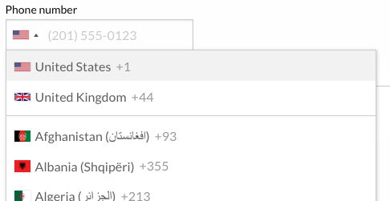

# ameotoko/form-phone-intl

This [Contao CMS](https://contao.org) extension provides a new "Phone number" field to use in the form generator.
The widget uses popular [jackocnr/intl-tel-input](https://github.com/jackocnr/intl-tel-input) library and requires Javascript to function.

## Features:

- Allows users to select a country code from configurable dropdown list instead of typing dial code (e.g. `+49`)
- Allows users to type in phone numbers in local formats (e.g. `01512 34567890` or `(0) 151 23456789`)
- Converts phone numbers to international format ([E.164](http://en.wikipedia.org/wiki/E.164)) automatically, allowing
for consistent storage or further processing (i.e. both previous examples will be stored as `+4915123456789` automatically)
- Displays an example for selected country as a placeholder

The list of countries can be configured to exclude certain countries or show only explicitly selected countries. You can also set "Preferred countries" to be shown on top of the list.

## Location detection (optional)

The widget is able to query [IPInfo](https://ipinfo.io) database and determine user's location based on their IP address.
Sign up for a free account at [IPInfo](https://ipinfo.io) to obtain your access token,
then paste it in the "IPInfo access token" field.
